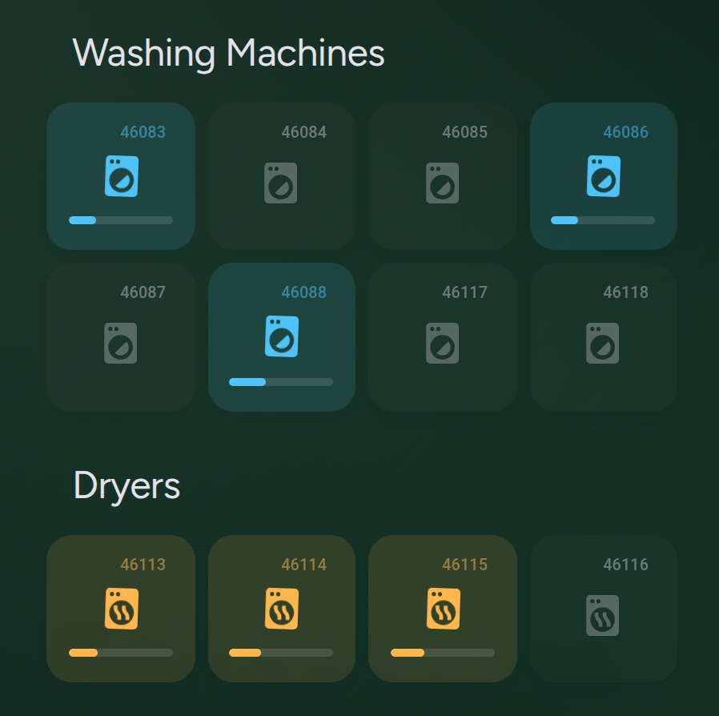
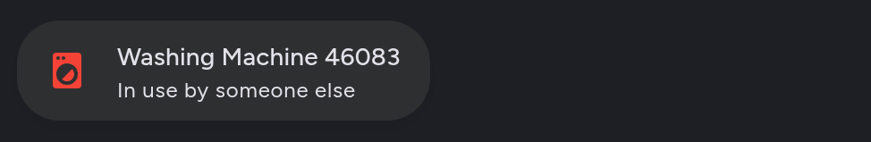

# AppWash Home Assistant Integration



Monitor your AppWash (Miele MOVE) laundry room from Home Assistant. Every washing machine and dryer at your location becomes a sensor, so you can see what is free, what is running, and — uniquely — which machine is running *your* wash. Cycle details, estimated finish time, progress and your prepaid balance are all exposed as attributes you can put on a card or trigger automations from.

[![Home Assistant][ha_badge]][ha_link] [![HACS][hacs_badge]][hacs_link] [![GitHub Release][release_badge]][release] [![Buy Me A Coffee][bmac_badge]][bmac] ![stars]

## Table of contents

**[`Installation`](#installation)**  **[`Configuration`](#configuration)** **[`Entities`](#entities)** **[`Attributes`](#attributes)** **[`Examples`](#examples)** **[`How it works`](#how-your-own-cycle-is-detected)** **[`Development`](#development)**
<br>

## Installation

#### HACS (Recommended)

This integration is not in the default HACS store yet, so add it as a custom repository first:

<div align="left">
  <a href="https://my.home-assistant.io/redirect/hacs_repository/?owner=Rishi8078&repository=Appwash-homeassistant&category=integration" target="_blank" rel="noopener noreferrer">
    
  </a>
</div>

Or manually: **HACS → Integrations → ⋮ → Custom repositories**, paste
`https://github.com/Rishi8078/Appwash-homeassistant`, choose category **Integration**, then install **AppWash** and restart Home Assistant.

#### Manual Installation

1. Download the latest [release](https://github.com/Rishi8078/Appwash-homeassistant/releases).
2. Copy the `custom_components/appwash` folder into your Home Assistant `config/custom_components/` directory, so that `config/custom_components/appwash/manifest.json` exists.
3. Restart Home Assistant.

#### Add the integration

1. Go to **Settings → Devices & Services → Add Integration**.
2. Search for **AppWash**.
3. Sign in with the account you use on [web.appwash.com](https://web.appwash.com).

Your location is taken from the preferred location on your account, so there is nothing else to fill in.

## Configuration

Everything is configured through the UI. No YAML is required.

| Option | Type | Default | Description |
| :-- | :-- | :-- | :-- |
| `email` | string | required | The email address of your AppWash / Miele MOVE account. |
| `password` | string | required | Your account password. Used once to sign in through Amazon Cognito; only the resulting token is kept in memory, and it is never written to the log. |
| `location_id` | string | auto | Set under **Configure** to poll a location other than the preferred one on your account. Leave empty to use the account default. |

> [!NOTE]
> Authentication goes through the Amazon Cognito hosted login that the AppWash web app uses. Tokens are refreshed automatically, and expired credentials trigger a normal Home Assistant re-authentication prompt.

## Entities

One sensor per machine, plus your wallet balance.

| Entity | State |
| :-- | :-- |
| `sensor.washing_machine_<code>` | `FREE` · `OCCUPIED` · `YOUR_CYCLE` |
| `sensor.dryer_<code>` | `FREE` · `OCCUPIED` · `YOUR_CYCLE` |
| `sensor.appwash_balance` | Prepaid balance in your account currency |

`<code>` is the number printed on the machine, for example `sensor.washing_machine_46083`.

**`YOUR_CYCLE`** replaces `OCCUPIED` when the cycle running on that machine belongs to your account. The `availability_status` attribute always keeps the raw API value, so both views are available.

> [!IMPORTANT]
> A template that checks for `OCCUPIED` will not match your own machine. Either add a `YOUR_CYCLE` branch, or test `state_attr(entity, 'availability_status') == 'OCCUPIED'` instead.

## Attributes

Present on every machine sensor:

| Attribute | Description |
| :-- | :-- |
| `machine_code`, `machine_id` | The machine number and its API id. |
| `product_group` | `WM` for washers, `TD` for tumble dryers. |
| `location_id` | The laundry room the machine belongs to. |
| `availability_status` | Raw API availability: `FREE` or `OCCUPIED`. |
| `occupied_by` | `you`, `other`, or `null` when the machine is free. |
| `status_since` | When the current occupancy started. |
| `fulfillment_id` | Identifies the occupancy. Equals your cycle id when the cycle is yours. |
| `checked_at`, `checked_from`, `checked_until` | Freshness window of the availability data. |
| `cycle_price`, `currency` | Price preview for starting a cycle on this machine. |
| `additional_info` | The occupancy sentence the backend returns. |
| `estimated_end`, `remaining_minutes` | Derived from the occupancy window. |
| `elapsed_minutes`, `progress_percent` | Derived progress through that window. |

Added only while one of **your** cycles is running on the machine:

| Attribute | Description |
| :-- | :-- |
| `cycle_id`, `cycle_status` | The cycle and its state, for example `ENABLED`. |
| `cycle_product_type`, `cycle_product_kind` | For example `FIX_CYCLE_WASHING` and `CYCLE`. |
| `cycle_order_id`, `cycle_termination_reason` | Order link, and why the cycle ended. |
| `cycle_created_at`, `cycle_ordered_at`, `cycle_enabled_at`, `cycle_stopped_at` | Cycle timeline. |
| `cycle_fulfillment_status` | `FULFILLING` while running, `FULFILLED` once done. |
| `cycle_order_status`, `cycle_paid_amount`, `cycle_description` | What you were charged. |

The balance sensor carries `available_balance`, `total_balance` and `authorized_balance`.

## Examples

### 🧺 Machine Status Card

A Mushroom template card that shows the three states differently, with the remaining time when the wash is yours.



<details>
<summary>View YAML</summary>

```yaml
type: custom:mushroom-template-card
primary: Washing Machine 46083
secondary: |
  
    Available
  
    Your wash · {{ state_attr('sensor.washing_machine_46083', 'remaining_minutes') }} min left
  
    In use by someone else
  
    Unknown
  
icon: mdi:washing-machine
icon_color: |
  
    green
  
    blue
  
    red
  
    grey
  
badge_icon: |
  {{ 'mdi:progress-clock' if is_state('sensor.washing_machine_46083', 'YOUR_CYCLE') }}
```

</details>

-----

### 🔢 How Many Machines Are Free

A template sensor counting free washers and dryers, useful as a single glance card.

<details>
<summary>View YAML</summary>

```yaml
template:
  - sensor:
      - name: Washers Free
        state: >
          {{ states.sensor
             | selectattr('entity_id', 'search', '^sensor\.washing_machine_')
             | selectattr('state', 'eq', 'FREE')
             | list | count }}
        unit_of_measurement: machines
        icon: mdi:washing-machine

      - name: Dryers Free
        state: >
          {{ states.sensor
             | selectattr('entity_id', 'search', '^sensor\.dryer_')
             | selectattr('state', 'eq', 'FREE')
             | list | count }}
        unit_of_measurement: machines
        icon: mdi:tumble-dryer
```

</details>

-----

### 🔔 Announce When Your Wash Finishes

Triggers when a machine *leaves* `YOUR_CYCLE`, which is the moment your cycle ends. The cycle finishing and the machine becoming free are two separate events in the API, so triggering on `to: FREE` can miss.

<details>
<summary>View YAML</summary>

```yaml
alias: Washing Done
triggers:
  - trigger: state
    entity_id:
      - sensor.washing_machine_46083
      - sensor.washing_machine_46084
      - sensor.washing_machine_46085
    from: YOUR_CYCLE
    not_to:
      - unavailable
      - unknown
conditions: []
actions:
  - variables:
      machine: "{{ state_attr(trigger.entity_id, 'machine_code') or trigger.entity_id }}"
  - action: notify.mobile_app
    data:
      title: Laundry
      message: "Wash {{ machine }} is complete. Please go get your clothes."
mode: queued
max: 3
```

</details>

-----

### ⏱️ Record When a Cycle Starts

Stores the real start time from the `status_since` attribute rather than the moment Home Assistant noticed, which can be up to a poll interval late.

<details>
<summary>View YAML</summary>

```yaml
alias: Update Last Wash Cycle
triggers:
  - trigger: state
    entity_id:
      - sensor.washing_machine_46083
      - sensor.washing_machine_46084
    to: YOUR_CYCLE
conditions: []
actions:
  - target:
      entity_id: input_datetime.last_wash_cycle
    data:
      datetime: >-
        
        {{ (started | as_datetime | as_local).strftime('%Y-%m-%d %H:%M:%S')
           if started else now().strftime('%Y-%m-%d %H:%M:%S') }}
    action: input_datetime.set_datetime
mode: single
max_exceeded: silent
```

</details>

-----

### 💰 Low Balance Warning

<details>
<summary>View YAML</summary>

```yaml
alias: AppWash balance low
triggers:
  - trigger: numeric_state
    entity_id: sensor.appwash_balance
    below: 5
conditions: []
actions:
  - action: notify.mobile_app
    data:
      message: >
        AppWash balance is down to {{ states('sensor.appwash_balance') }}
        {{ state_attr('sensor.appwash_balance', 'unit_of_measurement') or 'EUR' }}.
mode: single
```

</details>

## How your own cycle is detected

`GET /cycles` is scoped to the authenticated account, so it only ever returns your cycles. A busy machine carries an `availability.fulfillmentId`, and for your own cycles that value equals the cycle's `id`. Matching the two is what separates your wash from everyone else's:

| Condition | State | `occupied_by` |
| :-- | :-- | :-- |
| Fulfillment id matches one of your active cycles | `YOUR_CYCLE` | `you` |
| Fulfillment id set, but not among your cycles | `OCCUPIED` | `other` |
| Machine free | `FREE` | `null` |

An unmatched fulfillment id never falls back to matching on machine id, so a finished cycle of yours cannot make a stranger's wash look like your own. When a machine reports no fulfillment id at all, the machine id is used instead — that covers the short window after a cycle is enabled while availability still reads `FREE`.

## Polling

One coordinator update every 60 seconds serves every entity, no matter how many machines your location has:

```
GET /machines?location.id=<location>
GET /cycles?page=0&size=20&location.id=<location>
GET /account/wallet
```

A fourth request, `GET /order-items?kind=CYCLE`, is added only while one of your cycles is running — it supplies `cycle_fulfillment_status` and the amount charged. With no wash of your own in progress it is skipped entirely.

## Upgrading

<details>
<summary>From 2.1.x</summary>

- The device is now named **AppWash** instead of the location, which shortens every entity's friendly name. Entity IDs are unchanged.
- Five attributes were removed as duplicates or constants: `machine_name` (same as `machine_code`), `location_name` (already in the friendly name), `price_type` (always `FIX_PRICE`), `cycle_duration_minutes` (always the backend's fixed 120-minute window) and `is_own_cycle` (use `occupied_by == 'you'`).

</details>

<details>
<summary>From 1.x</summary>

AppWash migrated to the Miele MOVE API with Cognito login, and version 2 follows that migration.

- Entity IDs, entity names and unique IDs are **unchanged**.
- Machine states now use the values the API reports: **`FREE`** (previously `AVAILABLE`) and **`OCCUPIED`**, plus **`YOUR_CYCLE`**. Templates comparing against `AVAILABLE` must be updated.
- Existing config entries keep working; the location is resolved automatically from your account.

</details>

## Development

```bash
pip install -r requirements_test.txt
pytest
```

The tests run against a local fake API and a local fake Cognito server, so no credentials and no network access are required.

```
custom_components/appwash/   the integration, which is what HACS installs
tests/                       test suite
tools/                       read-only API discovery scripts, never imported at runtime
```

## Limitations

- Monitoring only. Starting, stopping or reserving machines and any payment operation are out of scope.
- The API exposes no remaining-time field. `estimated_end`, `remaining_minutes` and `progress_percent` are derived from the occupancy window the backend reports, which looks like a fixed two-hour slot rather than a live countdown. Treat them as estimates.
- Ownership is inferred from your own cycle list, because the API has no owner field. A machine occupied through a route that creates no cycle on your account reads as `OCCUPIED`.
- Only the machine types the API reports as `WM` and `TD` get sensors.
- One location per config entry.

## ☕ Support Development

If you find this integration useful, please consider supporting its development. Your contribution helps keep the project alive and growing.

<a href="https://coff.ee/rishi8078" target="_blank"></a>

-----

**AppWash Integration - Made with ❤️ for the Home Assistant community**

<!-- Link references -->
[ha_badge]: https://img.shields.io/badge/Home%20Assistant-Compatible-green
[ha_link]: https://www.home-assistant.io/
[hacs_badge]: https://img.shields.io/badge/HACS-Custom-orange
[hacs_link]: https://hacs.xyz/
[release_badge]: https://img.shields.io/github/v/release/Rishi8078/Appwash-homeassistant
[release]: https://github.com/Rishi8078/Appwash-homeassistant/releases
[bmac_badge]: https://img.shields.io/badge/buy_me_a-coffee-yellow
[bmac]: https://coff.ee/rishi8078
[stars]: https://img.shields.io/github/stars/Rishi8078/Appwash-homeassistant
